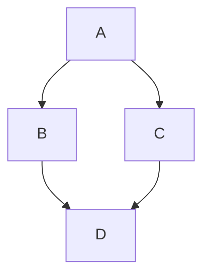

Projet : Texte “en orbite”
Idée du projet:
- crée une animation où un texte tourne lentement autour d’un centre, comme une planète autour du soleil.
Par exemple, le mot “Créatif” ou “Bienvenue” tourne autour d’un logo ou d'une image.

 L’objectif: 
 - c'est de donner un effet dynamique et spatial à une page web.
 - Apprendre à utiliser les transformations CSS (rotate, translate)
 - Comprendre les animations continues (boucles infinies)
 - Créer un effet esthétique sans bibliothèque externe.

 Technologies utilisées:
  - HTML → structure du texte et du cercle
  - CSS → animation (rotation, positionnement circulaire)
  - JavaScript → pour contrôler la vitesse ou le sens de rotation (optionnel)

 Résultat attendu:
 un élément central (un logo, un cercle vide, etc.), Autour, je places un texte positionné à une certaine distance du centre et je fais tourner 
ce texte autour du centre en utilisant une animation rotate().

