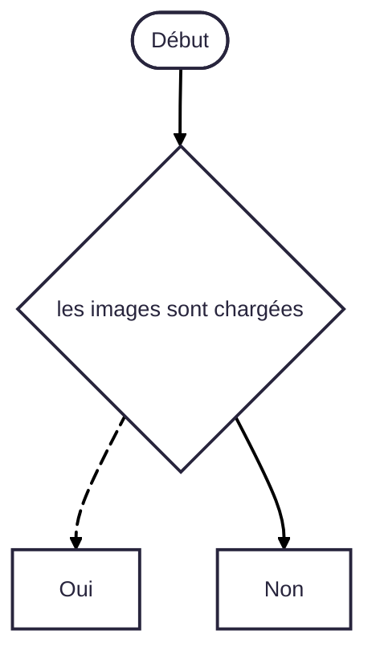

Résumé du projet – Galaxy Cube

Le projet Galaxy Cube est un mini-jeu interactif développé en HTML, CSS et JavaScript, dont l’objectif principal est de créer une expérience ludique, dynamique et visuellement immersive directement dans un navigateur web, sans utiliser de moteur de jeu externe.

Le but du jeu est simple : attraper un carré en mouvement dans un temps limité. À chaque clic réussi, le joueur marque des points, le carré change de couleur, un effet visuel et sonore est déclenché, et une citation motivante apparaît à l’écran. Le jeu est structuré en plusieurs niveaux de difficulté (facile, moyen, difficile, hardcore), avec une augmentation progressive de la vitesse, des contraintes de temps et du nombre de clics requis.

Le projet vise plusieurs objectifs :

- Mettre en pratique les bases du développement web interactif
- Comprendre la gestion des événements utilisateur (clics, temps, animations)
- Travailler la logique de jeu (score, chrono, niveaux, conditions de victoire)
- Créer une interface moderne et esthétique avec animations, effets lumineux et ambiance “galaxie”
- Améliorer l’expérience utilisateur grâce aux sons, aux citations et au feedback visuel

 Technologies utilisées:
  - HTML → structure du texte et du cercle
  - CSS → animation (rotation, positionnement circulaire)
  - JavaScript → pour contrôler la vitesse ou le sens de rotation (optionnel)

 Résultat attendu:
 
- Le joueur peut accéder à une page d’accueil puis lancer le jeu
- Le carré est visible, cliquable et en mouvement
- Le score s’incrémente correctement à chaque clic
- Un compte à rebours s’affiche avant le début de chaque partie
- Le chronomètre se déclenche et se met à jour en temps réel
- Des citations motivantes apparaissent lors des clics
- Un son est joué à chaque interaction
- Le joueur passe automatiquement au niveau suivant lorsqu’il réussit l’objectif
- Le jeu reste fluide, lisible et agréable à utiliser

  

